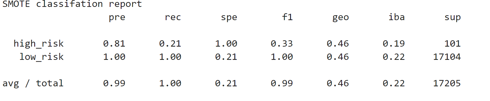
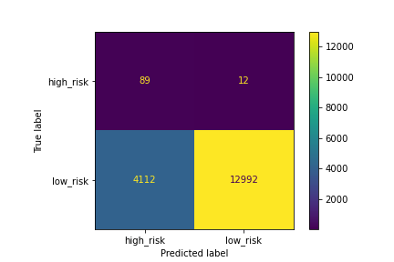
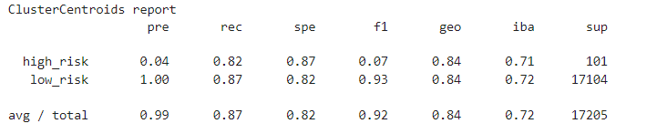
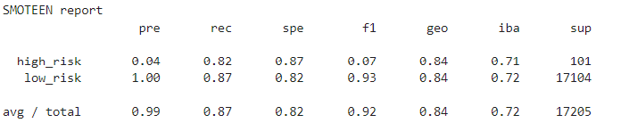
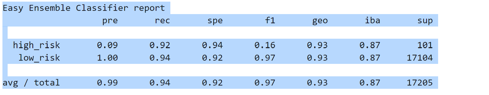
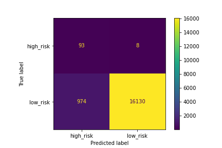

# Credit Risk Analysis
## Overview
Using the credit card credit dataset oversample the data using the RandomOverSampler and SMOTE algorithms, and undersample the data using the 
ClusterCentroids algorithm. 

Used a combinatorial approach of over- and undersampling using the SMOTEENN algorithm. 

Last compare two new machine learning models that reduce bias,BalancedRandomForestClassifier and EasyEnsembleClassifier, to predict credit risk. 

Once you’re done, you’ll evaluate the performance of these models and make a written recommendation on whether they should be used to predict credit risk.
## Deliverables / Analysis

### Results
* The resampling Models did not generate good scores they had a low F1 score Less than 0.08
* The EasyEnsambleClassifer did the best in classifing the loan score with an F1 score of 0.16. While not great it did preform the best out of all we tested.
### Deliverables

* Deliverable 1: Use Resampling Models to Predict Credit Risk
* Deliverable 2: Use the SMOTEENN Algorithm to Predict Credit Risk
* Deliverable 3: Use Ensemble Classifiers to Predict Credit Risk
* Deliverable 4: A Written Report on the Credit Risk Analysis (README.md)
### Deliverable 1: Use Resampling Models to Predict Credit Risk
* For all 3 alorgitims,(RandomOverSampler, SMOTE, ClusterCentroids) the following have been completed:
- Calculate the accuracy score of the model.
- Generate a confusion matrix.
- Print out the imbalanced classification report.
(RandomOverSampler)
- Calculate the accuracy score of the model. It was 0.833.
- Generate a confusion matrix.

- Print out the imbalanced classification report.

(SMOTE)
- Calculate the accuracy score of the model.
It was 0.833.
- Generate a confusion matrix.

- Print out the imbalanced classification report.

(ClusterCentroids)
- Calculate the accuracy score of the model.
It was 0.820.
- Generate a confusion matrix.

- Print out the imbalanced classification report.

### Deliverable 2: Use the SMOTEEN Algorithm to Predict Credit Risk
(SMOTEEN)
- Calculate the accuracy score of the model.
It was 0.844.
- Generate a confusion matrix.

- Print out the imbalanced classification report.

### Deliverable 3: Use Ensemble Classifiers to Predict Credit Risk

(Balanced Random Forest Classifier)
- Calculate the accuracy score of the model.
It was 0.759.
- Generate a confusion matrix.

- Print out the imbalanced classification report.

(EasyEnsembleClassifier)
- Calculate the accuracy score of the model.
It was 0.932.
- Generate a confusion matrix.

- Print out the imbalanced classification report.
